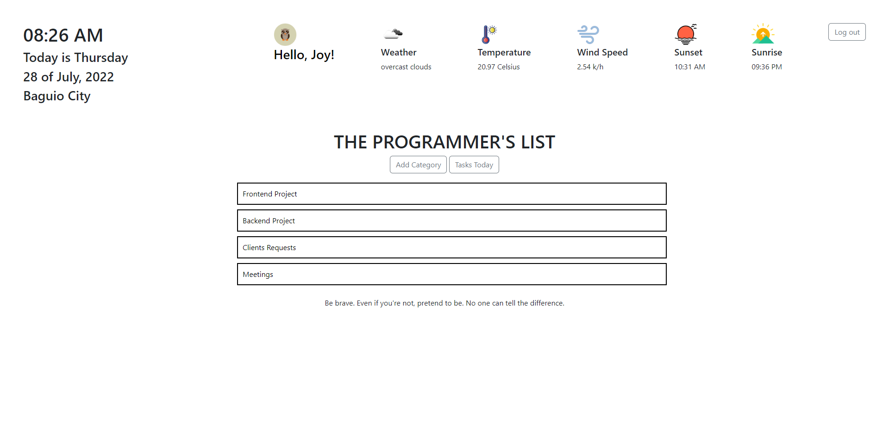

# Journal App
A Ruby on Rails application where user can add their daily tasks.

## Tools
1. Ruby on Rails
2. Bootstrap
3. Icon8 
4. Weather and slip API - `gem httparty`
5. Heroku for deployment

## Features
1. Allow user to create account and login
2. User can add categories and tasks
3. User can view task today and overdue tasks
4. Display weather updates
5. Display random advice

## UI

## Demo
["Daily Dose"](https://mighty-river-02026.herokuapp.com/)! Create your account and have fun :)

